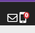
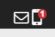

# Omnique Alert Reminder Version 1.0

#### Video Demo:  <URL HERE>

#### Description:

_If you intend to get down to buisness skip to Software Overview_ otherwise let me explain to you what a chrome extension does:

>Chrome Extensions are small software programs that customize the browsing experience. They enable users to tailor Chrome functionality and behavior to individual needs or preferences. They are built on web technologies such as HTML, JavaScript, and CSS.

>An extension must fulfill a single purpose that is narrowly defined and easy to understand. A single extension can include multiple components and a range of functionality, as long as everything contributes towards a common purpose.

>User interfaces should be minimal and have intent. They can range from a simple icon, such as the Google Mail Checker extension shown above, to overriding an entire page.

>Extension files are zipped into a single .crx package that the user downloads and installs. This means extensions do not depend on content from the web, unlike ordinary web apps.

>Extensions are distributed through the Chrome Developer Dashboard and published to the Chrome Web Store

## Software Overview

The purpose of this program is to remind the user that they have new SMS messages by opening the SME chat window when a new mesage is present on page reload.

This chrome extension checks for new SMS messages upon reloading the web page [Omnique](https://app.omnique.com/).

It is my intention for later versions to include real time data capture via the _Mutations Observer_ for both the SMS and E-mail notifications.

## Implitation Notes

This chrome extension is _only usable_ with the web page [Omnique](https://app.omnique.com/) (As per use of the Manifest file _all other web site will be useless to this extension_)

## Running this extension

1. Clone this repository.
2. Load this directory in Chrome as an [unpacked extension](https://developer.chrome.com/docs/extensions/mv3/getstarted/development-basics/#load-unpacked).
3. To ensure the extension is running properly check the web page console to see if the SMS count matches the SMS notification badge in the upper right hand corner of the page.
4. The notification should show: 
5. Send a test text message to the chat.
6. Wait for the message to be marked as received in the upper right hand corner of the page.
7. The notification should now show: 
8. Refresh the page, if the extension is working properly the chat window should open displaying the new Message in a new tab.

